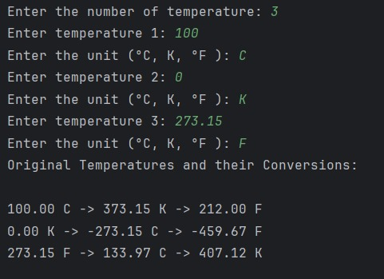

# Temperature-Conversion 
This Python program converts temperatures between Fahrenheit, Celsius, and Kelvin. It allows users to input multiple temperatures and provides conversions between all three temperature scales. The program also calculates and displays the average temperature, and identifies the highest and lowest temperatures.

# Features
- Convert temperatures from Fahrenheit to Celsius and vice versa.
- Handles input validation for temperature units.
- Outputs converted temperatures along with their units.

# Functions
- convert_temperature(temps, units, count):
  - Parameters:
    - temps (list of float): The list of temperatures to convert.
    - units (list of str): The units of the temperatures ('F', 'C', or 'K').
    - count (int): The number of temperatures to process.
  - Returns:
    - converted_temps (list of lists of float): The converted temperatures in Celsius and Kelvin.
    - converted_units (list of lists of str): The units of the converted temperatures.

# Usage
- Input
  - Enter the number of temperatures you want to convert.
  - Enter each temperature value followed by its unit (C, K, or F).
- Output
  - The program will display the original temperatures and their conversions in Celsius and Kelvin.

# Example I/O

  

